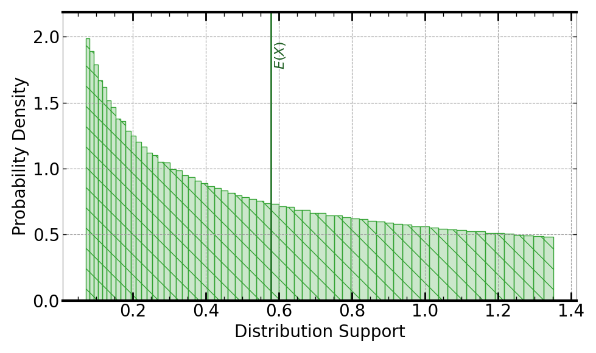

[](https://signaloid.io/repositories?connect=https://github.com/signaloid/Signaloid-Demo-Sensors-SensirionSFM3100ConversionRoutines#gh-dark-mode-only)
[](https://signaloid.io/repositories?connect=https://github.com/signaloid/Signaloid-Demo-Sensors-SensirionSFM3100ConversionRoutines#gh-light-mode-only)

# Sensirion SFM3100 Low Pressure Drop Analog Flow Meter Use Case
Example demonstrating real-time output uncertainty estimation for calibrated ADC values from the SFM3100 sensor[^1].

## Introduction
The SFM3100 is a Low Pressure Drop Analog Flow Meter.

## Getting started

The correct way to clone this repository to get the submodules is:
```sh
	git clone --recursive git@github.com:signaloid/Signaloid-Demo-Sensors-SensirionSFM3100ConversionRoutines.git
```

If you forgot to clone with `--recursive` and end up with empty submodule directories, you can remedy this with:
```sh
	git submodule update --init
```

## Running the application locally
Apart from using Signaloid's Cloud Compute Platform, you can compile and run this application
locally. Local execution is essentially a native Monte Carlo implementation,
that uses GNU Scientific Library (GSL)[^2] to generate samples for the different input distributions.
In this mode the application stores the generated output samples, in a file called `data.out`.
The first line of `data.out` contains the execution time of the Monte Carlo implementation
in microseconds (μs), and each
next line contains a floating-point value corresponding to an output sample value.

In order to compile and run this application in the native Monte Carlo mode:

1. Install dependencies (e.g., on Linux):
```
sudo apt-get install libgsl-dev libgslcblas0
```
1. Compile natively (e.g., on Linux):
```
cd src/
gcc -I. -I/opt/local/include main.c utilities.c common.c uxhw.c -L/opt/local/lib -o native-exe -lgsl -lgslcblas -lm
```
1. 46,4: 2. Run the application in the MonteCarlo mode, using (`-M`) command-line option:
```
./native-exe -M 10000
```
The above program runs 10000 Monte Carlo iterations.

3. See the output samples generated by the local Monte Carlo execution:
```
cat data.out
```

## Inputs
The only input to the SFM3100 sensor conversion algorithm is the raw ADC taken from the voltage flow output signal of the sensor ($U_\mathrm{V}$).

The uncertainty in $U_\mathrm{V}$ is modeled as a (`UniformDist(0.7, 0.8)`) Volts.

This use case demo does not implement the temperature conversion (see the lookup table plot on page 5 of the SFM3100 datasheet) and also does not yet implement the oxygen flow conversion (see Appendix B of the SFM3100 datasheet).


## Outputs
The output is the calibrated air flow (in standard liter per minute):
```math
\mathrm{Calibrated Sensor Output} = \left(U_{\mathrm{V}} - \frac{\mathrm{Offset}}{B}\right)\frac{A}{B}\mathrm{abs}\left(U_{\mathrm{V}} - \frac{\mathrm{Offset}}{B}\right)
```
where *A*, *B*, and *Offset* are modeled as constants taken from the SFM3100 datasheet[^1]:
```math
\mathrm{A} = 80
```
```math
\mathrm{B} = 1
```
```math
\mathrm{Offset} = 0.67
```

Following is an example output, using Signaloid's C0Pro-S+.



## Usage
```
Example: SFM3100 sensor conversion routines - Signaloid version

Usage: Valid command-line arguments are:
	[-o, --output <Path to output CSV file : str>] (Specify the output file.)
	[-S, --select-output <output : int>] (Compute 0-indexed output, by default 0.)
	[-M, --multiple-executions <Number of executions : int (Default: 1)>] (Repeated execute kernel for benchmarking.)
	[-T, --time] (Timing mode: Times and prints the timing of the kernel execution.)
	[-b, --benchmarking] (Benchmarking mode: Generate outputs in format for benchmarking.)
	[-j, --json] (Print output in JSON format.)
	[-h, --help] (Display this help message.)
```


---

[^1]: [SFM3100 Low Pressure Drop Analog Flow Meter](https://sensirion.com/media/documents/27637785/626A538D/GF_DS_SFM3100.pdf).

